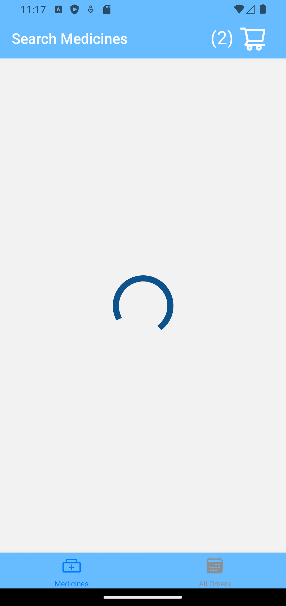
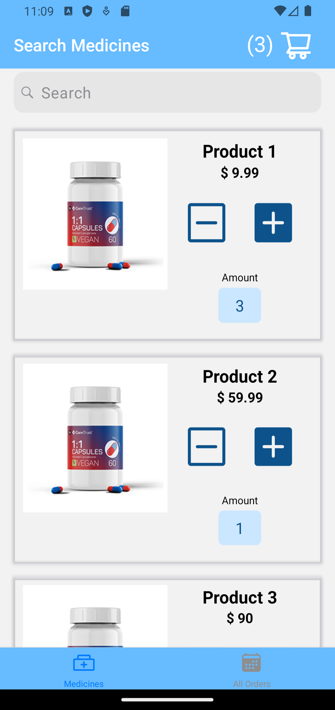
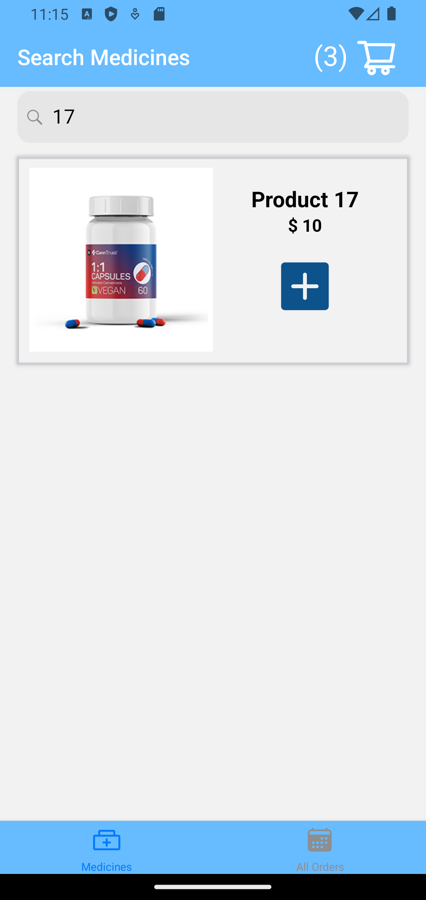
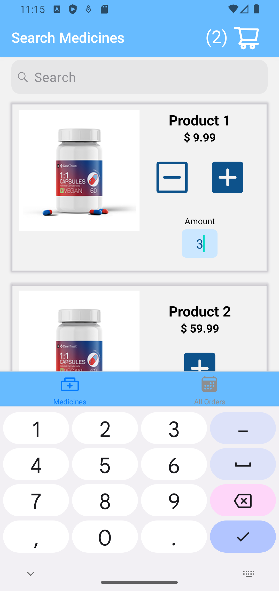
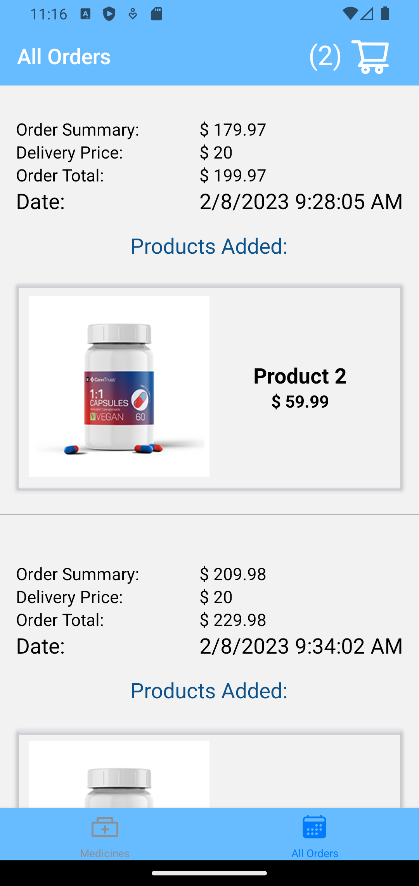
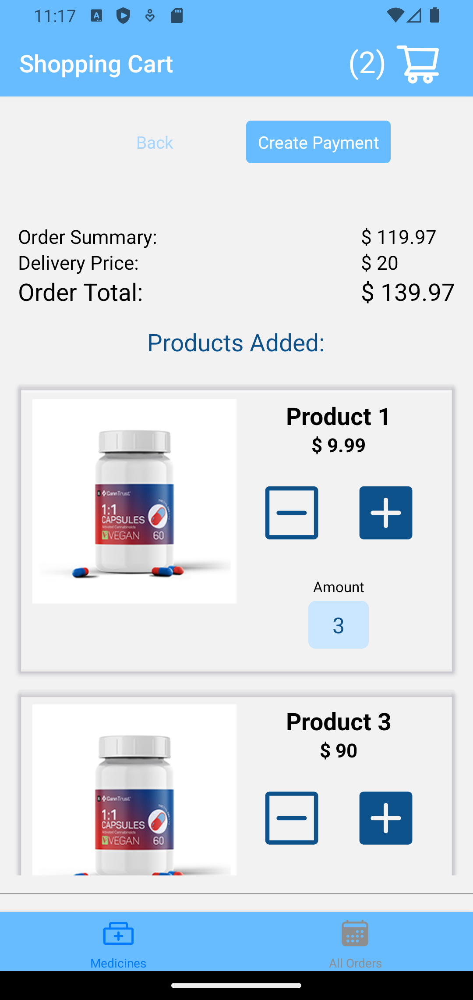

<!-- @format -->

# React Native Mobile App using Javascript

A cross-platform app using React Native with Expo emulating a medicines distributor marketplace

The app uses a mock server deployed in an Azure Web App.

## Highlights

### React Hooks

The most important react hooks are used within this app: useState, useEffect, useRef, useLayoutEffect, etc.

### React Memo

Is a small app like this it would be better not use React Memo but for demonstration purposes the Memoized library from react was also extensively used.

### HTTP Requests

The app uses a mock server deployed in an Azure Web App to demonstrate also the use of axios for HTTP Requests.

### React Native Navigation

There is also an example of a Native Stack Navigation nested in a Bottom Tab Navigation Stack.

## Most important comands

- Create the project: **npx create-expo-app --template**
- Install React Nativa Navigation: **npm install @react-navigation/native**
- Installing dependencies into an Expo managed project​: **npx expo install react-native-screens react-native-safe-area-context**
- Installing React Navigation Bottom Tabs: **npm install @react-navigation/bottom-tabs**
- Installing React Navigation Native Stack: **npm install @react-navigation/native-stack**
- Install Axios: **npm install axios**
- Install Redux: **npm install react-redux**
- Install Redux Toolkit: **npm install @reduxjs/toolkit**
- Install Redux Persist and React Native Asyn Storage: **npm i redux-persist @react-native-async-storage/async-storage**
- Install React Native Reanimated: **npx expo install react-native-reanimated**
- Install React Native SVG: **npx expo install react-native-svg**

The search component is based on the package **react-native-search-component**.
